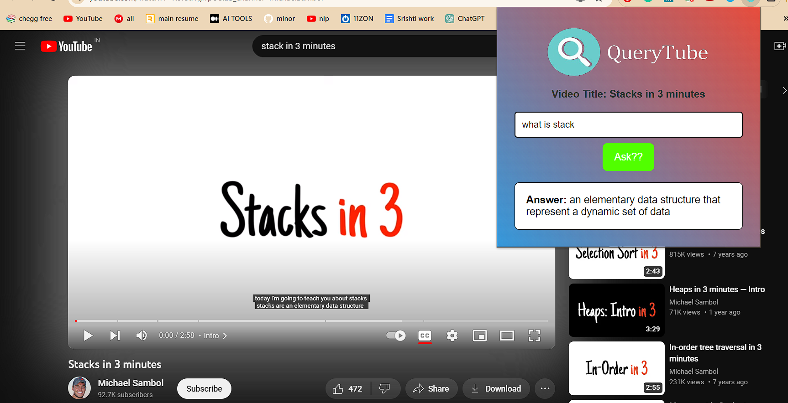
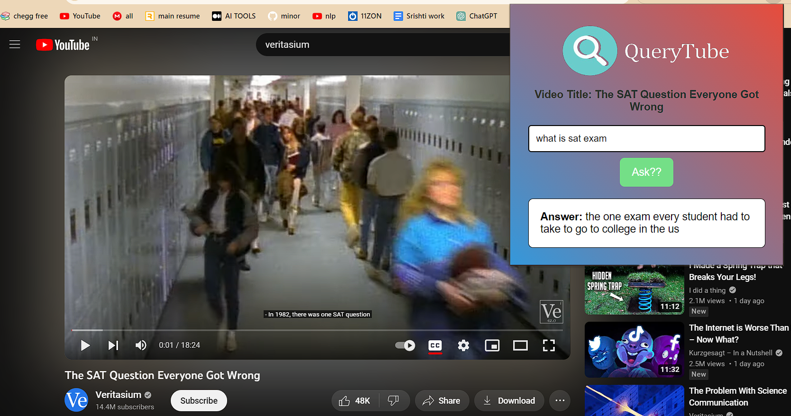

# ***QueryTube***
## Introduction
QueryTube is a Chrome extension that allows users to directly talk to the creators, by asking questions about the content of YouTube videos and receive answers. It utilizes a backend FastAPI server combined with natural language processing to provide insightful responses.

## Key Features
- **YouTube Integration:** Works seamlessly with YouTube pages to extract video information.
- **Question-Answering:** Employs natural language processing to answer user queries about video content.
- **User-Friendly Interface:** A simple and intuitive user interface for a seamless experience.

## Tech Stack
- **Frontend:** HTML, CSS, JavaScript
- **Chrome Extension API:** Interacts with the Chrome extension APIs for tab and popup management.
- **Backend:** FastAPI (Python), transformers library for question-answering model.
- **Natural Language Processing (NLP):** Utilizes transformers library for processing user queries.

## How to Use
1. **Install the Extension:**
   - Download the extension files or clone the repository.
   - Open Chrome and navigate to `chrome://extensions/`.
   - Enable "Developer mode" and click "Load unpacked."
   - Select the folder containing the extension files.

2. **Start the Backend:**
   - Navigate to the `main.py` file in your terminal.
   - Install the required dependencies using:
     ```bash
     pip install -r requirements.txt
     ```
   - Start the FastAPI server with:
     ```bash
     python -m uvicorn main:app --reload
     ```
   - The backend will start running on `http://127.0.0.1:8000`.
   - **Note:** Ensure the backend is running before using the extension, and replace `http://127.0.0.1:8000` with the actual URL if it's different.

3. **Ask a Question:**
   - Navigate to a YouTube video page.
   - Click on the QueryTube extension icon.
   - Enter your question in the input field.
   - Click the "Submit" button.

4. **View Answers:**
   - The extension will fetch the video title, and the backend will process the question.
   - The answer, along with the video title, will be displayed in the extension popup.

## Demo


